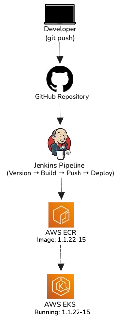

# 🚀 CI/CD Pipeline: Jenkins → AWS ECR → AWS EKS

End-to-end CI/CD automation pipeline designed to simulate real-world DevOps workflows on AWS.

This project implements a production-style CI/CD pipeline that automates application delivery to Kubernetes on AWS.

It eliminates manual deployment steps and ensures consistent, repeatable releases by integrating build automation, containerization, and Kubernetes deployment into a single automated workflow.

The pipeline uses **Jenkins Pipeline as Code** to orchestrate the full delivery workflow, including versioning, Docker image creation, container registry management, and Kubernetes deployment.

📖 **Architecture Deep Dive (Medium Article):**  
[From Manual Deployments to Automated Delivery on AWS](https://medium.com/@psalvador8/from-manual-deployments-to-automated-delivery-on-aws-22306147f43a)

---

# 📌 Project Overview

Modern cloud applications rely on automated pipelines to ensure reliable and repeatable software delivery.

This project demonstrates how to build a **complete CI/CD workflow** that automatically:

- increments the application version
- builds the Java artifact
- creates and tags a Docker container image
- pushes the image to **Amazon ECR**
- deploys the application to **Amazon EKS**
- commits version updates back to Git

The pipeline models a **real-world DevOps workflow** where code changes automatically progress through build, containerization, and deployment stages.

---

## 📈 Impact

- Eliminates manual build and deployment processes
- Ensures consistent and repeatable application releases
- Reduces risk of deployment errors through automation
- Demonstrates real-world CI/CD workflow used in cloud environments

---  

# 🧭 Architecture



### Pipeline Flow

```
Developer Push
      ↓
Git Repository
      ↓
Jenkins Pipeline
      ↓
Build Java Application (Maven)
      ↓
Build Docker Image
      ↓
Push Image to AWS ECR
      ↓
Deploy to AWS EKS
      ↓
Kubernetes Pods Updated
```

When code changes are pushed to the repository, Jenkins automatically triggers the pipeline, initiating the CI/CD workflow that builds, containerizes, and deploys the application.

The pipeline builds the application, creates a Docker image, pushes the image to **Amazon ECR**, and deploys the updated version to **Amazon EKS**.

Kubernetes then performs a rolling update of the running pods.

---

# 🧰 Technologies Used

- Jenkins (Pipeline as Code)
- Docker
- Kubernetes
- AWS EKS (Elastic Kubernetes Service)
- AWS ECR (Elastic Container Registry)
- Java
- Maven
- Git
- Linux

---

# ⚙️ Deployment Strategy

The pipeline automates the full application lifecycle from source code to production deployment.

The process includes:

1. Application build using Maven  
2. Docker container image creation  
3. Secure push to AWS ECR  
4. Deployment to Kubernetes workloads running on Amazon EKS  

Kubernetes handles the rolling update of application pods, ensuring minimal downtime during deployment.

---

# 🚀 Pipeline Stages

## 1️⃣ Version Increment (CI)

The pipeline automatically increments the patch version of the application using Maven version plugins.

Example:

```
1.1.21 → 1.1.22
```

This ensures each build produces a uniquely versioned artifact.

---

## 2️⃣ Build Application (CI)

```
mvn clean package
```

This stage compiles the application and produces the executable Java artifact.

---

## 3️⃣ Build & Push Docker Image (CI)

The pipeline then:

- builds a Docker image
- dynamically tags the image using the application version and build number
- authenticates with AWS ECR
- pushes the container image to the registry

Example image tag:

```
1.1.22-15
```

Using immutable version tags ensures reliable deployment rollbacks if needed.

---

## 4️⃣ Deploy to AWS EKS (CD)

Deployment is performed using Kubernetes manifests.

The pipeline dynamically injects the new container version into the deployment manifest:

```
envsubst < kubernetes/deployment.yaml | kubectl apply -f -
```

This updates the Kubernetes deployment with the latest container image.

---

## 5️⃣ Commit Version Update (CD)

After a successful deployment:

- Jenkins commits the updated `pom.xml`
- pushes changes to the `jenkins-jobs` branch
- uses `[ci skip]` to prevent recursive pipeline triggers

This ensures the repository always reflects the currently deployed application version.

---

# 🔐 Credential Management

Sensitive credentials are securely stored in the **Jenkins Credentials Store**, including:

- AWS Access Key & Secret
- ECR authentication credentials
- Git repository credentials

Secrets are injected into the pipeline at runtime and are **never stored directly in the repository**.

---

# 🛟 Reliability & Scalability

The system benefits from the scalability of both containerized workloads and managed Kubernetes infrastructure.

Key reliability mechanisms include:

- containerized application deployment
- rolling updates managed by Kubernetes
- versioned container images
- automated build and deployment pipeline
- separation of build and runtime environments

This architecture supports scalable and repeatable deployments.

## 🔁 Deployment Reliability

- Kubernetes rolling updates ensure zero-downtime deployments
- Versioned container images allow rollback to previous stable versions
- Immutable image tags prevent unintended overwrites
- Rolling updates combined with health checks ensure only healthy pods receive traffic

---

# 🧠 Design Decisions

This pipeline was designed to reflect real-world DevOps workflows, focusing on automation, traceability, and reliable application delivery.

- **Jenkins Pipeline as Code** ensures reproducible pipeline configuration
- **Docker containers** provide environment consistency across deployments
- **Amazon ECR** stores versioned container images securely
- **Amazon EKS** manages container orchestration and scaling
- **Immutable image tagging** improves traceability and rollback capabilities
- **Automated versioning** ensures consistent artifact management

These design decisions help model a realistic **DevOps delivery pipeline**.

---

# 🏗️ System Design Principles

This project demonstrates several core DevOps and cloud engineering principles.

### Automation

The entire build and deployment lifecycle is automated through Jenkins pipelines.

### Immutable Infrastructure

Container images are versioned and redeployed rather than modified in place.

### Continuous Delivery

New application versions can be deployed automatically through the pipeline.

### Scalability

Kubernetes automatically manages application scaling and rolling updates.

### Reproducibility

Infrastructure and pipeline configuration are defined as code.

---

# 🎯 What This Project Demonstrates

- CI/CD pipeline design using Jenkins
- Container image lifecycle management
- Kubernetes deployment automation
- AWS ECR container registry integration
- Automated versioning workflows
- Secure credential management
- End-to-end DevOps delivery pipeline

---

# 🚀 Potential Improvements

Future enhancements could include:

- Helm-based Kubernetes deployments
- automated unit and integration testing stages
- container security scanning (Trivy or Clair)
- monitoring with Prometheus & Grafana
- GitOps-style deployments using ArgoCD
- automated rollback strategies

---

# 📁 Repository Structure

```
├── README.md
├── Jenkinsfile
├── kubernetes/
│   └── deployment.yaml
├── docker/
│   └── Dockerfile
└── docs/
    └── architecture.png
```

---

# 💡 Key Takeaway

This project demonstrates how CI/CD pipelines can automate the full software delivery lifecycle.

By integrating Jenkins, Docker, Kubernetes, and AWS services, the pipeline enables consistent, repeatable deployments of containerized applications to cloud infrastructure.

---

# 👤 Author

**Priscilla Salvador**  
Cloud & DevOps Engineer
